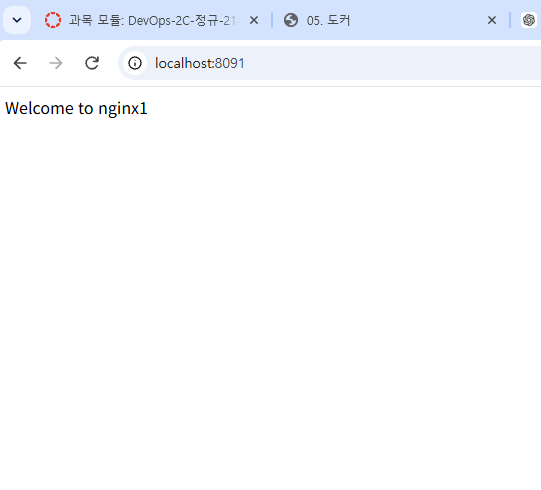
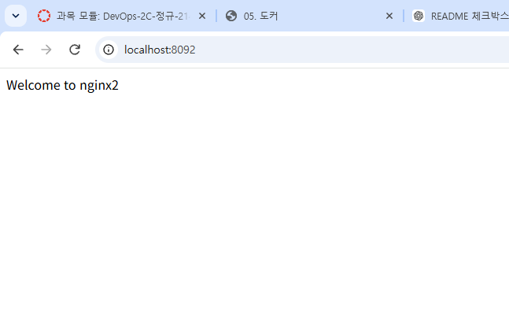
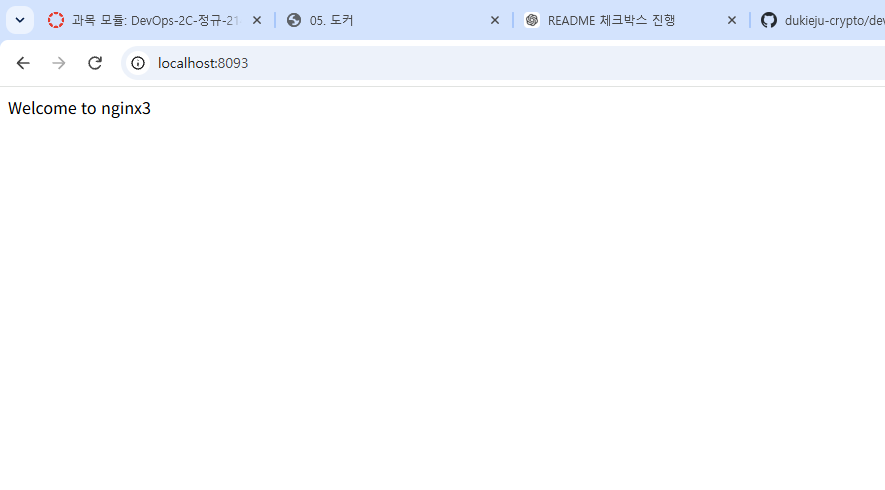
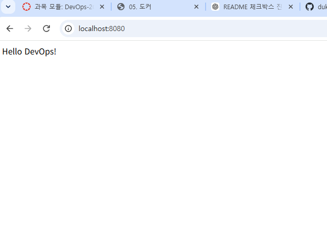

# Week 05 - Docker Nginx 실습

## 1. Docker 컨테이너 실행

nginx 컨테이너 3개를 각각 다른 포트와 이름으로 실행하였다.

* nginx1 → 8091 포트
* nginx2 → 8092 포트
* nginx3 → 8093 포트

```bash
docker run -d --name nginx1 -p 8091:80 nginx
docker run -d --name nginx2 -p 8092:80 nginx
docker run -d --name nginx3 -p 8093:80 nginx
```

## 2. index.html 수정

각 컨테이너에 `exec`로 접속하여 `index.html`을 수정하였다.

* nginx1 → `Welcome to nginx1`
* nginx2 → `Welcome to nginx2`
* nginx3 → `Welcome to nginx3`

## 3. 브라우저 확인

### nginx1


### nginx2


### nginx3


## 4. curl 확인

### n

## 5. docker ps 확인

`docker ps` 명령어를 통해 nginx1, nginx2, nginx3 컨테이너가 실행 중인 것을 확인하였다.


